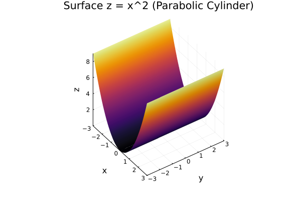
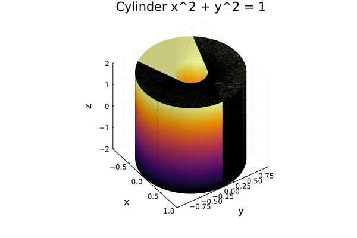
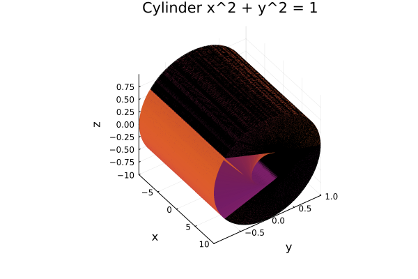

# 10.6 기둥과 이차 곡면

여기서는 두 가지 또 다른 곡면인 기둥과 이차 곡면을 조사한다.
곡면의 그래프를 그리기 위해서는 좌표 평면들과 평행인 평면과 곡면의 교선을 결정하면 쓸모 있다. 이런 곡선을 곡면의 **자국**이라 한다.

---

## 기둥

**기둥**은 주어진 평면 곡선을 지나고 주어진 직선에 평행인 직선 전체로 이루어진 곡선이다. 

### 보기 1

곡면 $z = x^2$의 그래프를 그려라.

**풀이**

```julia
using Plots

# x, y 격자 생성
xs = range(-3, 3, length=200)
ys = range(-3, 3, length=120)

# z = x^2 (y와 무관)
Z = [x^2 for y in ys, x in xs]   # 주의: 행은 y, 열은 x 순서

plot(
    xs, ys, Z;
    st = :surface,
    xlabel = "x", ylabel = "y", zlabel = "z",
    title = "Surface z = x^2 (Parabolic Cylinder)",
    camera = (55, 40),
    legend = false
)

```



### 보기 2

다음 곡면을 확인하고 그래프를 그려라

(a) $x^2 + y^2 = 1$

**풀이**

```julia
using Plots

# 매개변수 범위
θs = range(0, 2π, length=200)
zs = range(-2, 2, length=120)   # 원하는 높이(-2 ≤ z ≤ 2)로 조정

# 격자 생성 (행: z, 열: θ)
X = [cos(θ) for z in zs, θ in θs]
Y = [sin(θ) for z in zs, θ in θs]
Z = [z       for z in zs, θ in θs]

plot(X, Y, Z;
     st = :surface,
     xlabel = "x", ylabel = "y", zlabel = "z",
     title = "Cylinder x^2 + y^2 = 1",
     legend = false,
     camera = (55, 40))
```




(b) $y^2 + z^2 = 1$

```julia
using Plots

# 매개변수 범위
θs = range(0, 2π, length=200)
zs = range(-10, 10, length=120)   # 원하는 높이(-2 ≤ z ≤ 2)로 조정

# 격자 생성 (행: z, 열: θ)
Y = [cos(θ) for z in zs, θ in θs]
Z = [sin(θ) for z in zs, θ in θs]
X = [z       for z in zs, θ in θs]

plot(X, Y, Z;
     st = :surface,
     xlabel = "x", ylabel = "y", zlabel = "z",
     title = "Cylinder x^2 + y^2 = 1",
     legend = false,
     camera = (55, 40))

```



---

## 이차 곡면 

**이차 곡면**은 세 변수 $x, y, z$에 관한 이차 방정식의 그래프이다. 가장 일반적인 이런 방정식은 다음과 같다.

$$
Ax^2 + By^2 + Cz^2 + Dxy + Eyz + Fxz + Gx + Hy + Iz + J = 0
$$

여기서 $A, B, C, ..., J$는 상수이다. 그런데 이를 평행 이동하고 회전시켜서 다음과 같은 두 가지 표준 형 중 하나로 바 꿀 수 있다. 

$$
Ax^2 + By^2 + Cz^2 + J = 0, \quad Ax^2 + By^2 + Iz = 0
$$

이차 곡면은 삼차원 공간의 도형으로 평면의 원뿔 곡선 또는 이차 곡선에 대응한다.