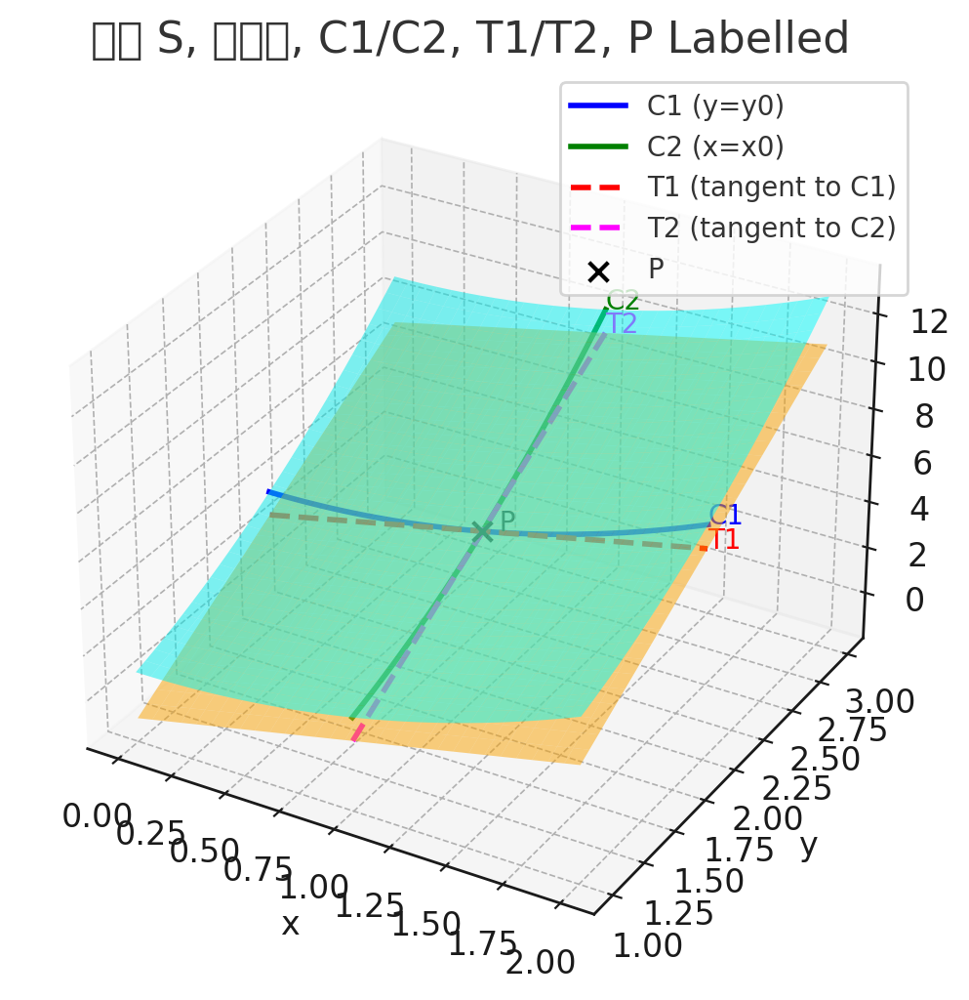

# 11.4 접평면과 선형 근사

일변수 미적분에서 가장 중요한 개념의 하나는, 미분 가능한 함수의 그래프에 있는 한 점을 향해 확대해가면서 그 그래프와 접선을 점점 더 구별할 수 없게 된고 이에 따라 함수를 선형 함수로 근접시킬 수 있다는 사실이다. 

3차원에서도 미분 가능한 이변수 함수의 그래프인 곡면에 있는 한 점을 향해 확대해가면서 곡면은 점점 더 평면(그것의 접평면)처럼 보이고 그 함수를 이변수 선형 함수로 근접 시킬 수 있다. 또 미분의 개념도 변수가 두 개 이상인 함수로 확장 가능하다.

---

## 접평면

곡면 $S$의 방정식ㅇ $z=f(x, y)$이고 $f$의 연속인 일계 편도함수들이 존재한다고 하자. 
$P(x_0, y_0, z_0)$를 곡면 $S$에 있는 점이라 하자. $C_1, C_2$를 각각 곡면 $S$를 지나는 $x = x_0, y=y_0$의 교선이라고 하자.

그러면 점 $P$는 $C_1, C_2$에 모두 놓여있다.

$T_1, T_2$를 각각 점 $P$에서 두 곡선 $C_1, C_2$에 대한 접선이라고 하자. 이때, 점 $P$에서 곡면 $S$에 대한 **접편명**을 두 접선 $T_1, T_2$를 모두 포함하는 명면으로 정의한다.

$C$가 점 $P$를 지나고 곡면 $S$에 놓여있는 임의의 곡선이면 $P$에서 이 곡선에 대한 접선 또한 이 접평면에 놓인다. 따라서 $P$에서 $S$에 대한 접평면은 $P$를 지나고 곡면 $S$에 놓여있는 곡선에 대한 $P$에서의 모든 가능한 접선으로 이루어진 것으로 생각할 수 있다. $P$에서의 접평면은 점 $P$근방에서 곡면 $S$에 가장 가까이 근접한 평면이다.

$P(x_0, y_0, z_0)$을 지나는 평면의 방정식은 다음과 같은 꼴이다.

$$
A(x - x_0) + B(y - y_0) + C(z - z_0) = 0
$$
이 방정식을 $C$로 나누고 $a = -A/C$와 $b = -B/C$로 놓으면 다음과 같은 꼴로 나타낼 수 있다.

$$
z - z_0 = a(x - x_0) + b(y - y_0)
$$
위의 방정식이 $P$에서의 접평면을 나타내면, 평면 $y = y_0$와의 교선은 반드시 접선 $T_1$이어야 한다. $y = y_0$을 대입하면 다음을 얻는다.

$$
z - z_0 = a(x - x_0), \quad y = y_0
$$

그리고 이것이 기울기가 $a$인 직선의 방정식임을 알 수 있다. $T_1$의 기울기는 $f_x(x_0, y_0)$이다. 따라서 $a = f_x(x_0, y_0)$이다.

마찬가지로 $x = x_0$를 대입하면 $z - z_0 = b(y - y_0)$을 얻는데 이는 접선 $T_2$를 표현한다. 그러므로 $b = f_y(x_0, y_0)$

> $f$의 연속인 편도함수들이 존재한다고 하자. $P(x_0, y_0, z_0)$에서 곡면 $z = f(x, y)$에 대한 접평면 방정식은 다음과 같다.
> $$
z - z_0 = f_x(x_0, y_0)(x - x_0) + f_y(x_0, y_0)(y - y_0)
$$

### 보기 1

점 $(1, 1, 3)$에서 타원 포물면 $z = 2x^2 + y^2$에 대한 접평면을 찾아라.

**풀이**

접평면 방정식에 따르면

$$
z - 3 = f_x(1, 1)(x - 1) + f_y(1, 1)(y - 1)
$$

$f_x(1, 1)= 4, f_y(1, 1) = 2$임으로 접선의 방정식은 $z = 4x + 2y - 3$

---

## 선형근사

보기 1에서 점 $(1,1,3)$에서 함수 $f(x, y) = 2x^2 + y^2$의 그래프에 대한 접평면의 방정식이 $z = 4x + 2y - 3$임을 알아봤다. 그러므로 두 그림 2와 3의 가시적인 증거에 비추어, 다음 이변수 선형 함수는 $(x,y)$가 $(1, 1)$의 근방에 있을 때 $f(x, y)$에 대한 좋은 근사이다.

$$
L(x, y) = 4x + 2y - 3
$$

함수 $L$을 $(1, 1)$에서 $f$의 **선형화** 또는 **선형 근사 함수**라고 한다.  그리고 다음과 같은 근사를 $(1, 1)$에서 $f$의 **선형근사** 또는 **접평면 근사**라 한다.

$$
f(x, y) \approx 4x + 2y - 3
$$

일반적으로 점 $(a, b, f(a, b))$에서 이변수 함수 $f$의 그래프에 대한 접평면 방정식은 $f_x$와 $f_y$가 연속일 때 다음과 같다. 

$$
L(x, y) = f(a, b) + f_x(a, b)(x - a) + f_y(a, b)(y - b) 
$$
이를 $(a,b)$에서 $f$의 **선형화** 또는 **선형 근사 함수**라고 한다. 

---

$f_x, f_y$가 연속이 아닐 때는 어떨까? 예를 들면

$$
f(x, y) = \begin{cases}
& \frac{xy}{x^2 + y^2} \quad (x, y) \ne (0, 0) \\
&0 \qquad \ \ \ (x, y) = (0, 0)
\end{cases}
$$

원점에서 이의 편미분 계수가 존재하는데, 실제로 $f_x(0, 0) = 0$이고 $f_y(0,0) = 0$이지만 직선 $x = y에 있는 모든 점에서 $f(x, y) = \frac{1}{2}$이다. 그러므로 이변수 함수는 그 편도함수가 모두 존재하는 경우에도 거칠게 행동할 수 있다. 이러한 행동을 **배제**하기 위해서, 미분가능한 이변수 함수의 개념을 공식화 한다. 

일변수 함수 $y = f(x)$의 경우 $x$가 $a$부터 $a + \Delta x$까지 변할 경우 $y$의 증분을 다음과 같이 정의했다. 

$$
\Delta y = f(a + \Delta x) - f(a)
$$

$f$가 $a$에서 미분 가능할 때, 다음이 성립한다.

$$
\Delta y = f'(a)\Delta x + \epsilon \Delta x
$$

여기서 $\Delta x \to 0, \epsilon \to 0$이다.

이제 이변수 함수 $z = f(x, y)$를 생각하고, $x$는 $a$부터 $a + \Delta x$까지 변하고 $y$는 $b$부터 $b + \Delta y$까지 변한다고 하자. 그러면 이에 대응하는 $z$의 **증분**은 다음과 같다. 

$$
\Delta z = f(a + \Delta x, b + \Delta y) - f(a, b)
$$

그러므로 증분 $\Delta z$는 $(x, y)$가 $(a, b)$부터 $(a + \Delta x, b + \Delta y)$까지 변할 때 $f$의 값의 변화를 표현한다. 

이변수 함수의 미분 가능성을 다음과 같이 정의한다.

>  [7]정의 
> $z = f(x, y)$일 때, $f$가 $(a, b)$에서 **미분 가능하다**는 것은 $\Delta z$를 다음과 같이 표현 할 수 있는 경우이다.
> $$
\Delta z = f_x(a, b)\Delta x + f_y(a, b)\Delta y + \epsilon_1 \Delta x + \epsilon_2 \Delta y
$$
> 여기서 $(\Delta x, \Delta y) \to (0, 0)$일 때, $\epsilon_1 \to 0, \epsilon_2 \to 0$이다. 

접평면은 접점의 근방에서 $f$의 그래프와 근접한다.

[7]정의로 미분 가능성을 확인하는 것이 때때로 어려운데, 다음 정리는 미분 가능하기 위한 간편한 충분 조건을 제공한다.

>  [8]정리 
> 두 편도함수 $f_x, f_y$가 $(a, b)$근방에서 존재하고 $(a,b)$에서 연속일 때, $f$는 $(a,b)$에서 미분가능하다.

### 보기 2

$f(x, y) = xe^{xy}$이 $(1, 0)$에서 미분가능함을 보이고, 이 점에서의 선형화를 찾아라. 이를 이용해서 $f(1.1, -0.1)$의 근사값을 찾아라.

**풀이**

$f_x(x, y) = e^{xy} + xye^{xy}$

$f_y(x, y) = x^2e^{xy}$

$f_x(1, 0) = 1$

$f_y(1, 0) = 1$

$f_x, f_y$가 연속이고 $(1, 0)$근처에서 정의됨으로 정리[8]에 따라 $f$는 미분가능하다.

선형화는 

$$
\begin{align}
L(x, y) &= f_x(a, b)(x - a) + f_y(a, b)(y - b) + f(a, b) \\
&= f_x(1, 0)(x - 1) + f_y(1, 0)(y - 0) + f(1, 0) \\
&= x - 1 + y + 1 \\
&= x + y
\end{align}
$$

이에 대응하는 선형 근사는 다음과 같다.

$xe^{xy} = x+ y$

그러므로 다음을 얻는다. $f(1.1, -0.1) \approx 1$

---
## 미분

$f_x, f_y$기 $z$에 대한 편민분이었다면 미분 $dz$는 **전미분**이라 부르기도 하며 $z$의 변화율을 나타낸다. 전미분은 다음과 같이 정의한다. 

$$
dz = f_x(x, y)dx + f_y(x, y)dy = \frac{\partial z}{\partial x}dx + \frac{\partial z}{\partial y} dy
$$

$dx =  x - a = \Delta x$, $dy = y - b = \Delta y$로 하면 $z$의 미분은 다음과 같다.

$$
dz = f_x(a, b)(x - a) + f_y(a, b)(y - b)
$$

선형근사를 하면 다음과 같이 쓸 수 있다. 

$$
f(x, y) \approx f(a, b) + dz
$$

### 보기 3

(a) $z = f(x, y) = x^2 + 3xy - y^2$일 때, 미분 $dz$를 찾아라

**풀이**

$dz = f_x(x, y)dx + f_y(x, y)dy = \frac{\partial z}{\partial x}dx + \frac{\partial z}{\partial y}dy$임으로 이를 적용해 미분 $dz$를 풀 수 있다.

$$
\begin{align}
dz &= f_x(x, y)dx + f_y(x, y)dy \\
&= (2x + 3y)dx + (3x - 2y)dy
\end{align}
$$

(b) $x$가 $2$부터 $2.05$까지 변하고 $y$는 $3$부터 $2.96$까지 변할 때, $\Delta z$와 $dz$의 값을 비교하라.

**풀이**

$dx = 2.05 - 2 = \Delta x = 0.05$, $dy = 2.96 - 3 = \Delta y$ 로 할 때, $dz = 0.65$이다.

이를 선형 근사하면 

$$
f(x, y) \approx f(a, b) + dz
$$

임으로 $\Delta z = f(a + \Delta x, b + \Delta y) - f(a, b)$를 적용하여 $\Delta z$를 구하면 $\Delta z = 0.64489$로 유사한 값을 가지게 된다.

---

## 변수가 세 개 이상인 함수

변수가 3개 이상인 함수에 대해서도 선형 근사, 미분 가능성, 미분을 비슷한 방법으로 정의할 수 있다. 미분 가능한 함수는 정의 7에 있는 식과 비슷한 식으로 정의한다. 미분 가능한 함수에 대해 **선형 근사**는 다음과 같다.

$$
f(x, y, z) \approx f(a, b, c) + f_x(a, b, c)(x - a) + f_y(a,b, c)(y - b) + f_z(a, b, c)(z - c)
$$

$\omega = f(x, y, z)$일 때 $\omega$의 **증분**은 다음과 같다.

$$
\Delta \omega = f(a + \Delta x, b + \Delta y, c + \Delta z) - f(a, b, c)
$$

**미분** $d\omega$는 독립변수인 세 미분 $dx, dy, dz$의 식으로 다음과 같이 정의한다.

$$
dw = \frac{\partial w}{\partial x}dx + \frac{\partial w}{\partial y}dy + \frac{\partial w}{\partial z}dz
$$

