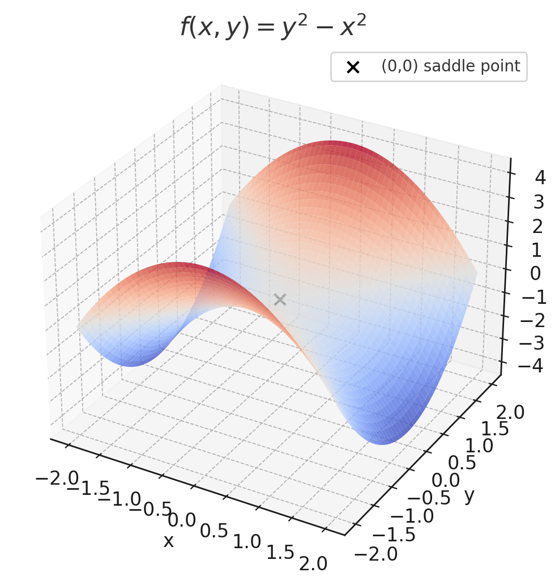

# 11.7 최댓값과 최솟값

>  [1]정의 
> 이변수 함수 $f$가 $(a,b)$에서 **극대**라는 것은, $(a,b)$의 근방에 있는 $(x,y)$에 대해 $f(x, y) \le f(a, b)$가 성립할 때이다. [이것은 중심이 $(a,b)$인 어떤 원판에 속한 모든 점 $(x,y)$에 대해 $f(x, y) \le f(a, b)$가 성립함을 뜻한다.] 수 $f(a, b)$를 **극대값**이라 한다. $(a, b)$근방의 $(x, y)$에 대해 $f(x, y) \ge f(a, b)$일 때, $f(a, b)$를 **극솟값**이라 한다.

>  [2]정리 
> $f$가 $(a, b)$에서 극대 또는 극소이고 $f$의 일계 편미분 계수들이 존재할 때, $f_x(a,b) = 0, f_y(x,y) = 0$이다.

그러므로 기하학적으로 해석하면, $f$의 극대 또는 극소에서 접평면이 존재하면, 그 접평면은 수평이다.

점 $(a, b)$를 $f$의 **임계점**(정류점)이라 하는 것은, $f_x(a, b)= 0$이고 $f_y(a, b) = 0$이거나 두 편미분 계수 중 하나가 존재하지 않는 경우이다.

그렇지만 일변수 미적분과 같이 모든 임계점에서 극대 또는 극소가 되는 것은 아니다. 임계점에서, 함수는 그대 또는 극소가 되기도 하고 어느 것도 되지 않을 수 있다.

### 보기 2

$f(x, y) = y^2 - x^2$의 극값을 찾아라.

**풀이**

$$
\begin{align}
f_x(x, y) &= -2x \\
f_y(x, y) &= 2y
\end{align}
$$

편미분이 모두 0이 되어야 함으로 $(0, 0)$이 임계점이다. $x$축에 있는 점에서 $y = 0$이므로 ($x \ne 0$) $f(x, y) = -x^2 < 0$이다. 그렇지만 $y$축에 있는 점에서 $x = 0$이므로 ($y \ne 0$일 때)$f(x, y) = y^2 > 0$이다. 그러므로 중심이 $(0, 0)$인 모든 원판에서 $f$는 양수 값과 함께 음수 값을 취한다. 따라서 $f(0,0) = 0$은 $f$의 극값이 될 수 없으므로, $f$에는 극값이 없다.

극대값과 극솟값의 정의에 따라 주변 $f(x, y) \le f(a, b)$ 또는 $f(x, y) \ge f(a, b)$를 만족시켜야 하나, 위의 그림과 같이 $y$축으로 가면 양수이고, $x$축으로 가면 음수가 된다. 따라서 극값이 존재하지 않는다.

---

보기 2와 같이 안장점이 존재할 경우와 같이 극값이 존재하지 않을 경우가 존재 할 수 있기 때문에 극값이 존재하는지를 판단할 필요가 있다. 이는 일변수 함수의 이계도 도함수 판정법과 비슷하다.

>  [3]이계 편도 함수 판정법 
> $f$의 이계 편도함수들이 중심 $(a, b)$인 함 원판에서 연속이고, $f_x(a, b) = 0$이며, $f_y(a, b) = 0$이라 하자. 즉 $(a,b)$를 임계점일 하자. 이를 아래와 같이 놓으면
> $$D = D(a, b) = f_{xx}(a, b)f_{yy}(a, b) - \{f_{xy}(a, b)\}^2$$
> (a) $D > 0$이고 $f_{xx}(a, b) > 0$이면, $f(a, b)$는 극솟값이다.
> (b) $D > 0$이고 $f_{yy}(a, b) < 0$이면, $f(a, b)$는 극댓값이다.
> (c) $D < 0$이면, $f(a, b)$는 극값이 아니다.

* 참고 1
    * (c)의 경우에 $(a, b)$를 $f$의 안장점이라 하며, $f$의 그래프와 $(a, b)$에서의 접평면은 서로 교차한다.
* 참고 2
    * $D = 0$일 때는 어떠한 정보도 얻을 수 없다. $f$는 $(a,b)$에서 극값을 취할 수도 있고, $(a,b)$가 $f$의 안장점일 수도 있다.
* 참고 3
    * $D$에 대한 공식을 기억하기 위해 이를 다음과 같은 행렬식으로 표현하는 것이 유용하다.
        $$
        D = \begin{vmatrix} f_{xx} & f_{xy} \\ f_{yx} & f_{yy} \end{vmatrix} = f_{xx}f_{yy} - (f_{xy})^2
        $$

### 보기 3

$f(x, y) = x^4 + y^4 - 4xy + 1$의 극값과 안장점을 찾아라.

**풀이**

이계편도함수 판정법에 따르면 $D > 0$이고 $f_{xx}(x, y) > 0$이면 극솟값, $D > 0$이고 $f_{yy}(x, y) < 0$이면 극댓값이며, $D < 0$이면 극값이 없는 안장점이다.

$$
\begin{align}
D &= f_{xx}(x, y)f_{yy}(x,y) - \{f_{xy}(x, y)\}^2 \\
f_{x}(x, y) &= 4x^3 - 4y \\
f_{y}(x, y) &= 4y^3 - 4x \\
f_{xx}(x, y) &= 12x^2 \\
f_{yy}(x, y) &= 12y^2 \\
f_{xy}(x, y) &= -4 \\
D &= (12xy)^2 - 16
\end{align}
$$

$f_{x}(x, y) = 0, f_y(x, y) = 0$로 놓았을 때, $x^3 = y, y^3 = x$임으로 $y = x^3$을 오른쪽 방정식에 대입하면

$$
\begin{align}
0 &= x^9 - x \\
& = x(x^8 - 1) \\
&= x(x^4 -1)(x^4 + 1) \\
&= x(x^2 - 1)(x^2 + 1)(x^4 + 1) \\
&= x(x - 1)(x + 1)(x^2 + 1)(x^4 + 1)
\end{align}
$$

그러므로 세 실근 $0, 1, -1$이 존재한다. 즉, critical point(임계점)은 $(0, 0), (1,1), (-1,-1)$이다.($y = x^3$)

여기서 각각의 임계점에 대해 $D$를 셈하면 $D(0, 0) = -16$, $D(1, 1) = 144 - 16 = 128$, $D(-1, -1) = 144$이다. $(0, 0)$이 안장점이며 $(1, 1)$일 때, $f_{xx} > 0$임으로 극솟값이며 $(-1, -1)$일 때도 $f_{xx} > 0$임으로 마찬가지로 극솟값이다.

### 보기 4
점 $(1, 0, -2)$부터 평면 $x + 2y + z = 4$까지의 최단 거리를 찾아라.

**풀이**

점 $(1, 0, -2)$에서 $x + 2y + z - 4 = 0$까지의 거리 공식은 다음과 같다.

$$
d = \sqrt{(x - 1)^2 + y^2 + (z + 2)^2}
$$

$x + 2y + z= 4$는 $z$에 관한 공식으로 바꾸면 $z = -x-2y + 4$이고 거리 $d$에서 $z$를 치환하면 아래와 같다.

$$
d = \sqrt{(x - 1)^2 + y^2 + (6 - x - 2y)^2}
$$

여기서 거리의 최소값을 얻기 위해 $d^2$에 대한 $f_x = 0, f_y = 0$인 편도함수를 구하면

$$
\begin{align}
f_x &= 2(x - 1) - 2(6 - x -2y) = 4x + 4y - 14 = 0 \\
f_y &= 2y - 4(6-x-2y) = 4x + 10y - 24 = 0
\end{align}
$$

연립방정식을 풀어보면 유일한 임계점은 $\left(\frac{11}{6}, \frac{5}{3}\right)$이다. $f_{xx} = 4, f_{yy} = 10, f_{xy} = 4$임으로 $D = 24 > 0$이고 $\left(\frac{11}{6}, \frac{5}{3}\right)$에서 극솟값을 취한다.

위의 $d$공식에 $\left(\frac{11}{6}, \frac{5}{3}\right)$를 대입하면 $\frac{5}{\sqrt{6}}$가 $((1, 0, -2))$에서 평면 $x + 2y + z = 4$평면까지의 가장 가까운 거리임을 알 수 있다.

---

## 최대값과 최솟값

**일변수 함수 $f$에 대한 최대 최소 정리에 의해, $f$가 닫힌 구간 $a, b$에 대해 연속이면 $f$는 최대값과 최솟값을 취한다.** 이변수 함수에 대해서도 비슷한 상황이 있다. 닫힌 구간이 그 끝점들을 포함하듯이, $\mathbb{R}^2$에서 **닫힌 집합** 은 그것의 경계점을 모두 포함하는 집합이다.

예를 들면 원 $x^2 + y^2 = 1$에 있는 모든 점과 그 내부에 있는 모든 점으로 이루어진 다음 원판은 닫힌 집합니다.

$$
D = \{(x, y)|x^2 + y^2 \le 1\}
$$

$\mathbb{R}^2$에서 **갇힌 집합**(유계 집합)은 어떤 원판에 포함되는 집합이다. 바꿔말하면, 그 범위가 유한인 집합이다. 그러면 닫히고 갇힌 집합을 이용해서 다음과 같이 최대 최소 정리의 이차원 형태를 서술 할 수 있다.

>  [4]이변수 함수의 최대$\cdot$최소 정리
> 함수 $f$가 $\mathbb{R}^2$의 닫히고 갇힌 집합 $D$에서 연속이면, $f$는 $D$에 속한 적당한 두 점 $(x_1, y_1)$과 $(x_2, y_2)$에서 최댓값 $f(x_1, y_1)$과 최솟값 $f(x_2, y_2)$를 취한다.

> 닫히고 갇힌 집합 $D$에서 연속 함수 $f$의 최댓값과 최솟값을 찾기 위해서
> 1. $D$에 속한 $f$의 임계점들에서 $f$의 값을 찾는다.
> 2. $D$의 경계점에서 $f$의 최대값과 최솟값을 찾는다. 
> 3. 단계 1과 2에서 찾은 값 중에서 가장 큰 것이 최댓값이고 가장 작은 것이 최솟값이다.

### 보기 6

직사각형 영역 $D = \{(x, y) | 0 \le x \le 3, 0\le y \le 2\}$에서 함수 $f(x, y) = x^2 - 2xy + 2y$의 최댓값과 최솟값을 찾아라.

**풀이**

$$
\begin{align}
f_x(x, y) &= 2x - 2y = 0 \\
f_y(x, y) &= -2x + 2 = 0 \\
x &= y \\
x &= 1
\end{align}
$$
critical point 가 $(1, 1)$임이나 극값이 존재하는지 확인하기 위해 이계도 편미분 판정법 $D$를 이용하면

$$
\begin{align}
f_{xx} &= 2 \\
f_{yy} &= 0 \\
f_{xy} &= -2 \\
D &= 2\cdot 0 - (-2)^2 = -4
\end{align}
$$

$D < 0$임으로 극값이 존재하지 않는다.

다음으로 각 끝 값의 경우에 대해 판단해 보면 정의역이 $D = \{(x, y) | 0 \le x \le 3, 0\le y \le 2\}$에서 가능한 경우의 수는 $(3, 0), (0, 2), (3, 2), (0, 0)$이고 경우의 수들을 계산해 보면

$$
\begin{align}
f(3, 0) &= 9 \\
f(0, 2) &= 4 \\
f(3, 2) &= 1 \\
f(0, 0) &= 0
\end{align}
$$

따라서 최소값은 $0$이고 최대값은 $9$임을 알 수 있다.

