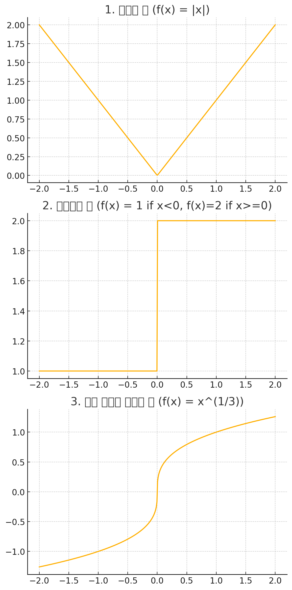

# 2.2 도함수

수 $a$가 변한다고 할때, $a$를 변수 $x$로 바꾸면, 다음을 얻는다.

$$
f^\prime (x) = \lim_{x\to 0}\frac{f(x + h) - f(x)}{h}
$$

이 극한이 존재하는 모든 수 $x$ 에 $f^\prime(x)$를 대응시킬 수 있다. 그러므로 $f^\prime$을 새로운 함수로 생각 할 수 있는데, 이를 **$f$의 도함수** 라 한다.

### 보기 2 

(a) $f(x) = x^3 - x$일 때, $f^\prime(x)$에 대한 식을 찾아라.

풀이

$$
\begin{align}
f^\prime(x) &=\lim_{h \to 0}\frac{f(x + h) - f(x)}{h} \\
&= \lim_{h \to 0 }\frac{(x + h)(x + h + 1)(x + h - 1) - x^3 + x}{h}\\
&= \lim_{h \to 0}3x^2 + 3xh + h^2 - 1 \\
&= 3x^2 - 1
\end{align}
$$

```julia
using Symbolics

@syms x
@syms h

exp1 = ((x + h)*(x + h + 1)*(x + h - 1) - x^3 + x)/ h

Symbolics.simplify(exp1)

```

### 보기 3
$f(x) = \sqrt{x}$일 때, $f$의 도함수를 찾아라. $f^\prime$의 정의역을 말하라.

풀이

$$
\begin{align}
f^\prime(x) &= \lim_{h \to 0}\frac{\sqrt{h+ x} - \sqrt{x}}{h} \\
&= \lim_{h \to 0}\frac{\sqrt{h+ x} - \sqrt{x}}{h} \cdot \frac{\sqrt{h+ x} + \sqrt{x}}{\sqrt{h+ x} + \sqrt{x}} \\
&= \lim_{h \to 0}\frac{h}{h(\sqrt{h+ x} + \sqrt{x})} \\
&= \lim_{h \to 0}\frac{1}{\sqrt{h+ x} + \sqrt{x}} \\
&= \frac{1}{2\sqrt{x}}
\end{align}
$$

따라서 $f^\prime$ 의 정의역은 $(0, \infin)$ 이다. ($f$의 정의역인 $[0, \infin)$ 보다 정의역이 작다.)

### 보기 4
$f(x) = \frac{1-x}{2 + x}$일 때 $f^\prime(x)$를 찾아라

풀이

⸻

1.	함수 정의
$$
f(x) = \frac{1 - x}{2 + x}
$$
2.	도함수의 정의
$$
f’(x) = \lim_{h \to 0} \frac{f(x + h) - f(x)}{h}
$$
3.	$f(x+h)$ 쓰기
$$
f(x + h) = \frac{1 - (x + h)}{2 + (x + h)}
= \frac{1 - x - h}{2 + x + h}
$$
4.	차분 몫 작성
$$
\frac{f(x+h) - f(x)}{h}
= \frac{1}{h}\Biggl(\frac{1 - x - h}{2 + x + h} - \frac{1 - x}{2 + x}\Biggr)
$$
5.	분자 통분
$$
\frac{1 - x - h}{2 + x + h} - \frac{1 - x}{2 + x}
= \frac{(1 - x - h)(2 + x) - (1 - x)(2 + x + h)}{(2 + x + h)(2 + x)}
$$
따라서
$$
\frac{f(x+h) - f(x)}{h}
= \frac{1}{h};\frac{(1 - x - h)(2 + x) - (1 - x)(2 + x + h)}{(2 + x + h)(2 + x)}.
$$
6.	분자 전개 및 정리
$
\begin{align}
(1 - x - h)(2 + x) &= (1 - x)(2 + x) - h(2 + x),\\
(1 - x)(2 + x + h) &= (1 - x)(2 + x) + h(1 - x).
\end{align}$
따라서 분자는
$$
(1 - x - h)(2 + x) - (1 - x)(2 + x + h)
= -h\bigl[(2 + x) + (1 - x)\bigr]
= -3h.
$$
7.	h 약분 및 극한 취하기
$$
\frac{f(x+h) - f(x)}{h}
= -\frac{3}{(2 + x + h)(2 + x)}
;(2 + x)^2.
$$

⸻

최종 답:
$$
\boxed{,f’(x) = -\frac{3}{(2 + x)^2},}
$$

## 다른 기호

전통적인 기호 $y = f(x)$를 사용해서 독립 변수는 $x$로 종속 변수는 $y$로 나타낼 때, 몇 가지 일반적으로 사용되는 도함수에 대한 기호는 다음과 같다.

$$
f^\prime(x) = y^\prime = \frac{dy}{dx} = \frac{d}{dx}f(x) = Df(x) = D_xf(x)
$$

$D$와 $d/dx$를 **미분연산자** 라고 하는데, 도함수를 셈하는 과정인 미분하기 또는 미분법 연산을 나타내기 때문이다.

### 미분 가능한 함수

> <span style="color:blue">[3]정의</span> 함수 $f$에 대해 $f^\prime(a)$가 존재할 때, $f$ 는 $a$에서 미분가능하다고 한다. $f$가 열린 구간 (a, b)에 속한 모든 수에서 미분 가능 ㅎ라 때, $f$는 그 열린구간에서 미분 가능하다고 한다.


> <span style="color:blue">[4]정리</span>  $f$가 $a$에서 미분 가능하면, $f$는 $a$에서 연속이다.
> 그러나 역은 참이 아니다. 연속이더라도 미분가능 하지 않을 수 있다. (e.g., $f(x) =|x|$ 좌극한과 우극한이 같지만, 왼쪽과 오른쪽의 미분값이 다르기 때문에 미분 가능하지 않다.)

### 함수가 미분 불가능한 경우

1. 뾰족 점일 경우
2. 연직 접선이 존재할 경우
3. 불연속일 경우
<div style="width: 400px" >



</div>


### 고계 도함수

$f$ 가 미분 가능한 함수이면, 그 도함수 $f^\prime$ 또한 함수이고 이에 따라 $f^\prime$의 도함수가 존재할 수 있다. 이 새로운 함수 $f^{\prime\prime}$ 로 나타낸다. 이 새로운 함수 $f^{\prime\prime}$ 를 $f$의 이계 도함수라 한다.

라이프니츠 기호로 아래와 같이 표현 할 수 있다.

$$
\frac{d}{dx}\left(\frac{d}{dx}\right) = \frac{d^2y}{dx^2}
$$

### 보기 6

$f(x) = x^3 -x$ 일 때, $f^{\prime\prime}(x)$를 찾고 그 의미를 해석하라.

풀이

이미 $f(x) = x^3 -x$ 에 대한 도함수는 알고 있다. $f^\prime(x) = 3x^2 - 1$ 임으로 $f^\prime(x)$ 에 대한 고계 도함수를 구하면 된다.

$$
\begin{align}
f^{\prime\prime}(x) &= \lim_{h \to 0}\frac{3(x + h)^2 - 1 - 3x^2 + 1}{h} \\
&= \lim_{h\to 0}\frac{h(6x + 3h)}{h} \\
&= 6x
\end{align}
$$


