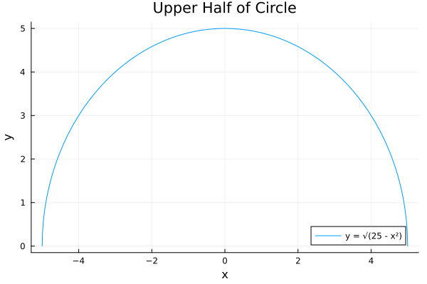
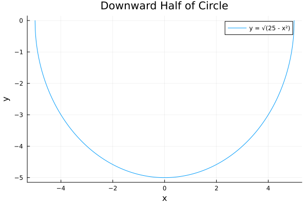

# 2.6 음함수의 미분법

어떤 함수는 다음과 같이 $x$, $y$사이의 관계를 통해 묵시적으로, 곧 음함수로 정의된다.(음침한 함수???)

1. $x^2 + y^2 = 25$
2. $x^3 + y^3 = 6xy$

1번과 2번의 경우 $x$에 관한 양함수로 나타 낼 수 있다.

1. $y = \pm\sqrt{25 - x^2}$ 

이 함수의 경우 $y = +\sqrt{25 - x^2}$, $y = -\sqrt{25 - x^2}$ 가 각각 원의 위쪽과 아래쪽 그래프를 나타내는 것을 알 수 있다.

```julia
using Plots

f(x) = sqrt(25 - x^2)

x_vals = -5:0.01:5


p = plot(x_vals, f.(x_vals), label="y = √(25 - x²)", xlabel="x", ylabel="y", title="Upper Half of Circle")
p2 = plot(x_vals, (-).(f.(x_vals)), label="y = √(25 - x²)", xlabel="x", ylabel="y", title="Downward Half of Circle")

savefig(p, "images/upper_half_of_circle")
savefig(p2, "images/down_half_of_circle")
```
1. $y = +\sqrt{25 - x^2}$ 

    

2. $y = -\sqrt{25 - x^2}$ 

    

다행스럽게도, $y$의 도함수를 찾기 위해, 방정식을 $y$에 대해 $x$의 식으로 풀 필요가 없다. 그 대신에 **음함수의 미분법**을 사용 할 수 있다.

이는 방정식의 양 변을 각각 $x$에 대해 미분한 다음에 그 결과로 얻은 방정식을 $y'$에 대해 푸는 과정으로 이루어진다. 


### 보기 1

(a) $x^2 + y^2 + 25$ 일 때 $\frac{dy}{dx}$를 찾아라.

풀이

방정식 $x^2 + y^2 + 25$ 의 양변을 미분하면 다음과 같다.

$$
\begin{align}
\frac{d}{dx}(x^2 + y^2) &= \frac{d}{dx}25 \\
\frac{d}{dx}(x^2) + \frac{d}{dx}(y^2) & = 0 \\
\end{align}
$$

$y$ 가 $x$의 함수임을 상기하고 연쇄법칙을 이용하면 다음을 얻는다.

$$
\frac{d}{dx}(y^2) = \frac{d}{dy}(y^2)\frac{dy}{dx} = 2y\frac{dy}{dx}
$$

그러므로 다음이 성립한다.

$$
2x + 2y\frac{dy}{dx} = 0
$$

이제 이 방정식을 $\frac{dy}{dx}$에 대해 풀면 다음을 얻는다.

$$
\frac{dy}{dx} = -\frac{x}{y}
$$


### 보기 2
$x^3 + y^3 = 6xy$(데카르트 입사귀선)일 때, $y'$ 을 찾아라

풀이

$$
\frac{d}{dx}(x^3) + \frac{d}{dx}(y^3) = \frac{d}{dx}6xy
$$

$$
3x^2 + 3y^2\frac{dy}{dx} = 6y + 6x\frac{dy}{dx}
$$

$$
x^2 + y^2\frac{dy}{dx} = 2y + 2x\frac{dy}{dx}
$$

$$
x^2 + y^2y' = 2y + 2xy'
$$

$$
(y^2 - 2x)y' = 2y - x^2
$$

$$
y' = \frac{2y - x^2}{y^2 - 2x}
$$

$x = y = 3$ 일 때, $y` = \frac{6 - 9}{9 - 6} = -1$이다.

직선의 방정식에 따라 $y - 3 = -1(x - 3)$ 은 $y = -x+ 6$ 이다.

### 보기 3
$\sin{(x + y)} = y^2\cos{x}$ 일때 $y'$ 을 찾아라.

풀이

$$
\begin{align}
\frac{d}{dx}\bigl(\sin{(x + y)}\bigr) &= \frac{d}{dx}\bigl(y^2\cos{x}\bigr)\\
\cos{(x + y)}\,(1 + y') &= 2y\,y'\cos{x} - y^2\sin{x}\\
\cos{(x + y)} + y'\cos{(x + y)} &= 2y\,y'\cos{x} - y^2\sin{x}\\
y'\bigl(\cos{(x + y)} - 2y\cos{x}\bigr) &= -y^2\sin{x} - \cos{(x + y)}\\
y' &= \frac{-y^2\sin{x} - \cos{(x + y)}}{\cos{(x + y)} - 2y\cos{x}} \\
&= \frac{y^2\sin{x} + \cos{(x + y)}}{2y\cos{x} - \cos{(x + y)}}
\end{align}
$$

